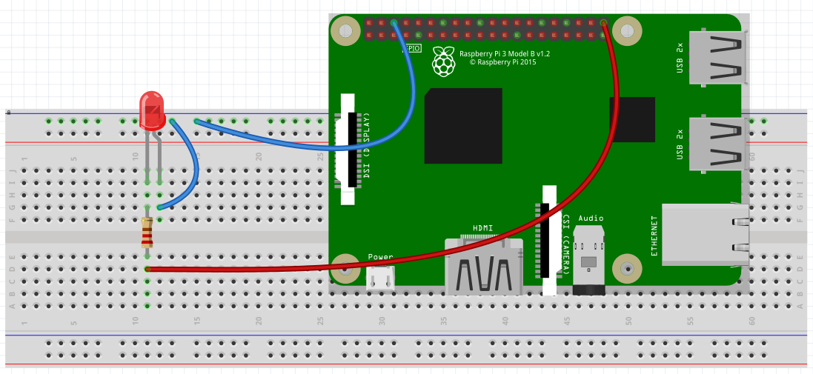
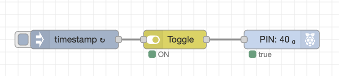
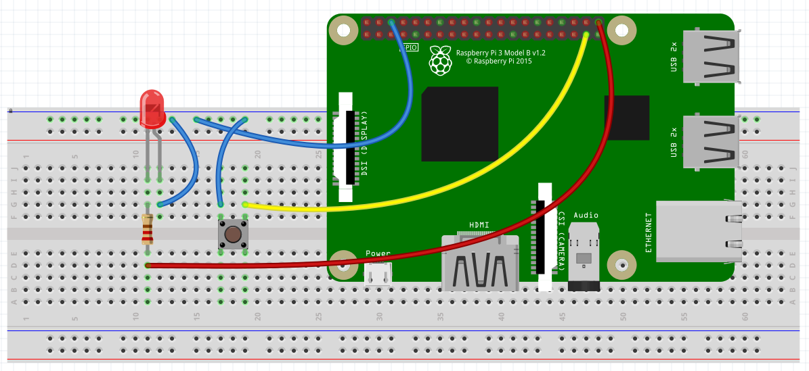
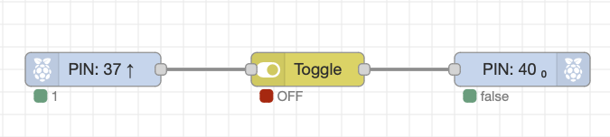
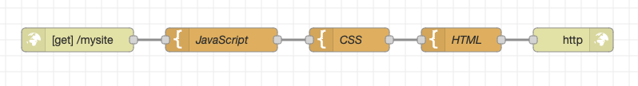
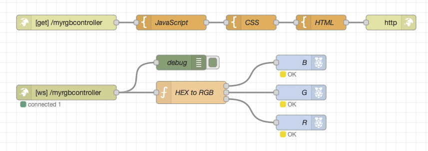
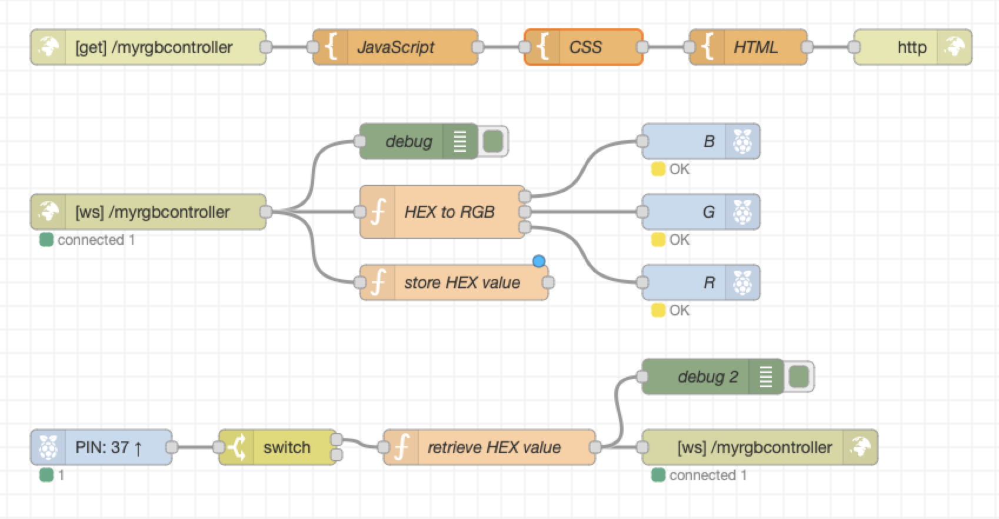

# idl4-cc-node-red-rpi

## Node-RED (basics)

### Your first circuit

#### Circuit

#### Flow

	[
		{
			"id": "f1de87166743083b",
			"type": "rpi-gpio out",
			"z": "69c38f1beeb5c50b",
			"name": "",
			"pin": "21",
			"set": "",
			"level": "0",
			"freq": "",
			"out": "out",
			"bcm": true,
			"x": 460,
			"y": 340,
			"wires": []
		},
		{
			"id": "b4ea1ab78479bc24",
			"type": "inject",
			"z": "69c38f1beeb5c50b",
			"name": "",
			"props": [
				{
					"p": "payload"
				},
				{
					"p": "topic",
					"vt": "str"
				}
			],
			"repeat": "",
			"crontab": "",
			"once": false,
			"onceDelay": 0.1,
			"topic": "",
			"payload": "true",
			"payloadType": "bool",
			"x": 230,
			"y": 340,
			"wires": [
				[
					"f1de87166743083b"
				]
			]
		},
		{
			"id": "0920a95452acbd74",
			"type": "inject",
			"z": "69c38f1beeb5c50b",
			"name": "",
			"props": [
				{
			"p": "payload"
				},
				{
					"p": "topic",
					"vt": "str"
				}
			],
			"repeat": "",
			"crontab": "",
			"once": false,
			"onceDelay": 0.1,
			"topic": "",
			"payload": "false",
			"payloadType": "bool",
			"x": 230,
			"y": 400,
			"wires": [
				[
					"f1de87166743083b"
				]
			]
		}
	]

### Blinking LED

#### Circuit

#### Flow

	[
		{
			"id": "d9a9b9aa83caae0b",
			"type": "rpi-gpio out",
			"z": "e08c0da476decd5e",
			"name": "",
			"pin": "21",
			"set": true,
			"level": "0",
			"freq": "",
			"out": "out",
			"bcm": true,
			"x": 520,
			"y": 220,
			"wires": []
		},
		{
			"id": "253cb9021c914b37",
			"type": "toggle",
			"z": "e08c0da476decd5e",
			"name": "",
			"onOffTopic": "X",
			"onValue": "true",
			"onType": "bool",
			"offValue": "false",
			"offType": "bool",
			"toggleTopic": "",
			"toggleValue": "",
			"toggleType": "any",
			"passOnOff": "ifChanged",
			"x": 350,
			"y": 220,
			"wires": [
				[
					"d9a9b9aa83caae0b"
				]
			]
		},
		{
			"id": "758893a3c947886c",
			"type": "inject",
			"z": "e08c0da476decd5e",
			"name": "",
			"props": [
				{
					"p": "payload"
				},
				{
					"p": "topic",
					"vt": "str"
				}
			],
			"repeat": "",
			"crontab": "",
			"once": false,
			"onceDelay": 0.1,
			"topic": "",
			"payload": "",
			"payloadType": "date",
			"x": 180,
			"y": 220,
			"wires": [
				[
					"253cb9021c914b37"
				]
			]
		}
	]
	
### Switch

#### Circuit

#### Flow

	
	[
		{
			"id": "244cd0a2c293fd68",
			"type": "rpi-gpio in",
			"z": "10a5f914b7088318",
			"name": "",
			"pin": "26",
			"intype": "up",
			"debounce": "25",
			"read": true,
			"bcm": true,
			"x": 160,
			"y": 180,
			"wires": [
				[
					"8ae6161202666574"
				]
			]
		},
		{
			"id": "1b5302e8e3c83357",
			"type": "rpi-gpio out",
			"z": "10a5f914b7088318",
			"name": "",
			"pin": "21",
			"set": true,
			"level": "0",
			"freq": "",
			"out": "out",
			"bcm": true,
			"x": 540,
			"y": 180,
			"wires": []
		},
		{
			"id": "8ae6161202666574",
			"type": "toggle",
			"z": "10a5f914b7088318",
			"name": "",
			"onOffTopic": "X",
			"onValue": "true",
			"onType": "bool",
			"offValue": "false",
			"offType": "bool",
			"toggleTopic": "",
			"toggleValue": "false",
			"toggleType": "bool",
			"passOnOff": "",
			"x": 350,
			"y": 180,
			"wires": [
				[
					"1b5302e8e3c83357"
				]
			]
		}
	]
	
### RGB-LED (basic)

#### Circuit

#### Flow

	[
		{
			"id": "e19f66f0e913b410",
			"type": "rpi-gpio out",
			"z": "524949a46aa74ae0",
			"name": "R",
			"pin": "21",
			"set": "",
			"level": "0",
			"freq": "",
			"out": "pwm",
			"bcm": true,
			"x": 550,
			"y": 320,
			"wires": []
		},
		{
			"id": "325d1f5a448c2207",
			"type": "rpi-gpio out",
			"z": "524949a46aa74ae0",
			"name": "G",
			"pin": "20",
			"set": "",
			"level": "0",
			"freq": "",
			"out": "pwm",
			"bcm": true,
			"x": 550,
			"y": 260,
			"wires": []
		},
		{
			"id": "31946b9e42c6f185",
			"type": "rpi-gpio out",
			"z": "524949a46aa74ae0",
			"name": "B",
			"pin": "16",
			"set": "",
			"level": "0",
			"freq": "",
			"out": "pwm",
			"bcm": true,
			"x": 550,
			"y": 200,
			"wires": []
		},
		{
			"id": "779477ab50e4a9c5",
			"type": "inject",
			"z": "524949a46aa74ae0",
			"name": "",
			"props": [
				{
					"p": "payload"
				},
				{
					"p": "topic",
					"vt": "str"
				}
			],
			"repeat": "",
			"crontab": "",
			"once": false,
			"onceDelay": 0.1,
			"topic": "",
			"payload": "0",
			"payloadType": "num",
			"x": 330,
			"y": 140,
			"wires": [
				[
					"31946b9e42c6f185"
				]
			]
		},
		{
			"id": "4b74ef8ea60a934e",
			"type": "inject",
			"z": "524949a46aa74ae0",
			"name": "",
			"props": [
				{
					"p": "payload"
				},
				{
					"p": "topic",
					"vt": "str"
				}
			],
			"repeat": "",
			"crontab": "",
			"once": false,
			"onceDelay": 0.1,
			"topic": "",
			"payload": "100",
			"payloadType": "num",
			"x": 330,
			"y": 180,
			"wires": [
				[
					"31946b9e42c6f185"
				]
			]
		},
		{
			"id": "b3fc44abe82d8d59",
			"type": "inject",
			"z": "524949a46aa74ae0",
			"name": "",
			"props": [
				{
					"p": "payload"
				},
				{
					"p": "topic",
					"vt": "str"
				}
			],
			"repeat": "",
			"crontab": "",
			"once": false,
			"onceDelay": 0.1,
			"topic": "",
			"payload": "0",
			"payloadType": "num",
			"x": 330,
			"y": 240,
			"wires": [
				[
					"325d1f5a448c2207"
				]
			]
		},
		{
			"id": "57357c1fdd522855",
			"type": "inject",
			"z": "524949a46aa74ae0",
			"name": "",
			"props": [
				{
					"p": "payload"
				},
				{
					"p": "topic",
					"vt": "str"
				}
			],
			"repeat": "",
			"crontab": "",
			"once": false,
			"onceDelay": 0.1,
			"topic": "",
			"payload": "100",
			"payloadType": "num",
			"x": 330,
			"y": 280,
			"wires": [
				[
					"325d1f5a448c2207"
				]
			]
		},
		{
			"id": "c8ed0c208a5c4861",
			"type": "inject",
			"z": "524949a46aa74ae0",
			"name": "",
			"props": [
				{
					"p": "payload"
				},
				{
					"p": "topic",
					"vt": "str"
				}
			],
			"repeat": "",
			"crontab": "",
			"once": false,
			"onceDelay": 0.1,
			"topic": "",
			"payload": "0",
			"payloadType": "num",
			"x": 330,
			"y": 340,
			"wires": [
				[
					"e19f66f0e913b410"
				]
			]
		},
		{
			"id": "090cb18ecaeb5165",
			"type": "inject",
			"z": "524949a46aa74ae0",
			"name": "",
			"props": [
				{
					"p": "payload"
				},
				{
					"p": "topic",
					"vt": "str"
				}
			],
			"repeat": "",
			"crontab": "",
			"once": false,
			"onceDelay": 0.1,
			"topic": "",
			"payload": "100",
			"payloadType": "num",
			"x": 330,
			"y": 380,
			"wires": [
				[
					"e19f66f0e913b410"
				]
			]
		}
	]
	
### RGB-LED (advanced)

#### Circuit

#### Flow

	[
		{
			"id": "ffa1b2fae0e89a3e",
			"type": "rpi-gpio out",
			"z": "d16962be0f87af64",
			"name": "R",
			"pin": "21",
			"set": "",
			"level": "0",
			"freq": "",
			"out": "pwm",
			"bcm": true,
			"x": 570,
			"y": 580,
			"wires": []
		},
		{
			"id": "554870b4ea8527f3",
			"type": "rpi-gpio out",
			"z": "d16962be0f87af64",
			"name": "G",
			"pin": "20",
			"set": "",
			"level": "0",
			"freq": "",
			"out": "pwm",
			"bcm": true,
			"x": 570,
			"y": 520,
			"wires": []
		},
		{
			"id": "f80ac0247cd6a333",
			"type": "rpi-gpio out",
			"z": "d16962be0f87af64",
			"name": "B",
			"pin": "16",
			"set": "",
			"level": "0",
			"freq": "",
			"out": "pwm",
			"bcm": true,
			"x": 570,
			"y": 460,
			"wires": []
		},
		{
			"id": "1c800be5dfd3d8e1",
			"type": "function",
			"z": "d16962be0f87af64",
			"name": "HEX to RGB",
			"func": "var hex = msg.payload\n\n// Parse hex value into three separate 2-digit hex values for red, green, and blue\n// Omit the #-character\nvar r = parseInt(hex.substring(1, 3), 16);\nvar g = parseInt(hex.substring(3, 5), 16);\nvar b = parseInt(hex.substring(5, 7), 16);\n\n// Map the values to percentage\nconst values = [r,g,b]\nconst valuesPercentage = values.map(x => x/255*100);\n\n// Prepare 3 messages with seperate percentages\nvar msg0 = {\"payload\":valuesPercentage[2]}\nvar msg1 = {\"payload\":valuesPercentage[1]}\nvar msg2 = {\"payload\":valuesPercentage[0]}\n\n// Return the messages to each output\nreturn [msg0, msg1, msg2];",
			"outputs": 3,
			"noerr": 0,
			"initialize": "",
			"finalize": "",
			"libs": [],
			"x": 370,
			"y": 520,
			"wires": [
				[
					"f80ac0247cd6a333"
				],
				[
					"554870b4ea8527f3"
				],
				[
					"ffa1b2fae0e89a3e"
				]
			]
		},
		{
			"id": "551bdaf8ff3e477d",
			"type": "inject",
			"z": "d16962be0f87af64",
			"name": "",
			"props": [
				{
					"p": "payload"
				},
				{
					"p": "topic",
					"vt": "str"
				}
			],
			"repeat": "",
			"crontab": "",
			"once": false,
			"onceDelay": 0.1,
			"topic": "",
			"payload": "#FF00FF",
			"payloadType": "str",
			"x": 160,
			"y": 480,
			"wires": [
				[
					"1c800be5dfd3d8e1"
				]
			]
		},
		{
			"id": "3c1dbcf68ccad300",
			"type": "inject",
			"z": "d16962be0f87af64",
			"name": "",
			"props": [
				{
					"p": "payload"
				},
				{
					"p": "topic",
					"vt": "str"
				}
			],
			"repeat": "",
			"crontab": "",
			"once": false,
			"onceDelay": 0.1,
			"topic": "",
			"payload": "#66CDAA",
			"payloadType": "str",
			"x": 160,
			"y": 520,
			"wires": [
				[
					"1c800be5dfd3d8e1"
				]
			]
		},
		{
			"id": "4d41f6ea15b6ef12",
			"type": "inject",
			"z": "d16962be0f87af64",
			"name": "",
			"props": [
				{
					"p": "payload"
				},
				{
					"p": "topic",
					"vt": "str"
				}
			],
			"repeat": "",
			"crontab": "",
			"once": false,
			"onceDelay": 0.1,
			"topic": "",
			"payload": "#00FF00",
			"payloadType": "str",
			"x": 160,
			"y": 440,
			"wires": [
				[
					"1c800be5dfd3d8e1"
				]
			]
		},
		{
			"id": "45842211584ed4cb",
			"type": "inject",
			"z": "d16962be0f87af64",
			"name": "",
			"props": [
				{
					"p": "payload"
				},
				{
					"p": "topic",
					"vt": "str"
				}
			],
			"repeat": "",
			"crontab": "",
			"once": false,
			"onceDelay": 0.1,
			"topic": "",
			"payload": "#FF0000",
			"payloadType": "str",
			"x": 160,
			"y": 560,
			"wires": [
				[
					"1c800be5dfd3d8e1"
				]
			]
		},
		{
			"id": "c6ce401359f09074",
			"type": "inject",
			"z": "d16962be0f87af64",
			"name": "",
			"props": [
				{
					"p": "payload"
				},
				{
					"p": "topic",
					"vt": "str"
				}
			],
			"repeat": "",
			"crontab": "",
			"once": false,
			"onceDelay": 0.1,
			"topic": "",
			"payload": "#FF69B4",
			"payloadType": "str",
			"x": 160,
			"y": 600,
			"wires": [
				[
					"1c800be5dfd3d8e1"
				]
			]
		}
	]

### A simple webserver

#### Flow

    [
        {
            "id": "84d1187e98bc279c",
            "type": "http in",
            "z": "59feef6de71de89c",
            "name": "",
            "url": "/mysite",
            "method": "get",
            "upload": false,
            "swaggerDoc": "",
            "x": 130,
            "y": 120,
            "wires": [
                [
                    "c51333f224e17c3a"
                ]
            ]
        },
        {
            "id": "1a716920d736b104",
            "type": "template",
            "z": "59feef6de71de89c",
            "name": "CSS",
            "field": "payload.style",
            "fieldType": "msg",
            "format": "html",
            "syntax": "mustache",
            "template": "",
            "output": "str",
            "x": 470,
            "y": 120,
            "wires": [
                [
                    "d1c8a352d5779b90"
                ]
            ]
        },
        {
            "id": "c51333f224e17c3a",
            "type": "template",
            "z": "59feef6de71de89c",
            "name": "JavaScript",
            "field": "payload.script",
            "fieldType": "msg",
            "format": "javascript",
            "syntax": "plain",
            "template": "",
            "output": "str",
            "x": 310,
            "y": 120,
            "wires": [
                [
                    "1a716920d736b104"
                ]
            ]
        },
        {
            "id": "bc2b4398a53b688d",
            "type": "http response",
            "z": "59feef6de71de89c",
            "name": "",
            "statusCode": "",
            "headers": {},
            "x": 750,
            "y": 120,
            "wires": []
        },
        {
            "id": "d1c8a352d5779b90",
            "type": "template",
            "z": "59feef6de71de89c",
            "name": "HTML",
            "field": "payload",
            "fieldType": "msg",
            "format": "html",
            "syntax": "mustache",
            "template": "<!DOCTYPE html>\n<html>\n  <head>\n    <title>My site</title>\n    \n  </head>\n  <body>\n    <h1>Hello world!</h1>\n  </body>\n</html>\n",
            "output": "str",
            "x": 610,
            "y": 120,
            "wires": [
                [
                    "bc2b4398a53b688d"
                ]
            ]
        }
    ]

### RGB-LED controller using websockets 

#### Circuit

#### Flow

    [
        {
            "id": "0cfcd15c8ca7c08c",
            "type": "function",
            "z": "3a7867a795775d21",
            "name": "HEX to RGB",
            "func": "var hex = msg.payload\n\n// Parse hex value into three separate 2-digit hex values for red, green, and blue\n// Omit the #-character\nvar r = parseInt(hex.substring(1, 3), 16);\nvar g = parseInt(hex.substring(3, 5), 16);\nvar b = parseInt(hex.substring(5, 7), 16);\n\n// Map the values to percentage\nconst values = [r,g,b]\nconst valuesPercentage = values.map(x => x/255*100);\n\n// Prepare 3 messages with seperate percentages\nvar msg0 = {\"payload\":valuesPercentage[2]}\nvar msg1 = {\"payload\":valuesPercentage[1]}\nvar msg2 = {\"payload\":valuesPercentage[0]}\n\n// Return the messages to each output\nreturn [msg0, msg1, msg2];",
            "outputs": 3,
            "noerr": 0,
            "initialize": "",
            "finalize": "",
            "libs": [],
            "x": 470,
            "y": 340,
            "wires": [
                [
                    "c078c4e8b82cd26d"
                ],
                [
                    "cdaca49678e5d8d6"
                ],
                [
                    "30b29f1013fbb89f"
                ]
            ]
        },
        {
            "id": "fb89c01c6abde5f6",
            "type": "websocket in",
            "z": "3a7867a795775d21",
            "name": "",
            "server": "2cce1aceba3f7db2",
            "client": "",
            "x": 220,
            "y": 340,
            "wires": [
                [
                    "9b97d9eebe58d68b",
                    "0cfcd15c8ca7c08c"
                ]
            ]
        },
        {
            "id": "c078c4e8b82cd26d",
            "type": "rpi-gpio out",
            "z": "3a7867a795775d21",
            "name": "B",
            "pin": "16",
            "set": "",
            "level": "0",
            "freq": "",
            "out": "pwm",
            "bcm": true,
            "x": 690,
            "y": 280,
            "wires": []
        },
        {
            "id": "cdaca49678e5d8d6",
            "type": "rpi-gpio out",
            "z": "3a7867a795775d21",
            "name": "G",
            "pin": "20",
            "set": "",
            "level": "0",
            "freq": "",
            "out": "pwm",
            "bcm": true,
            "x": 690,
            "y": 340,
            "wires": []
        },
        {
            "id": "30b29f1013fbb89f",
            "type": "rpi-gpio out",
            "z": "3a7867a795775d21",
            "name": "R",
            "pin": "21",
            "set": "",
            "level": "0",
            "freq": "",
            "out": "pwm",
            "bcm": true,
            "x": 690,
            "y": 400,
            "wires": []
        },
        {
            "id": "1666244ebb5af16d",
            "type": "http in",
            "z": "3a7867a795775d21",
            "name": "",
            "url": "/myrgbcontroller",
            "method": "get",
            "upload": false,
            "swaggerDoc": "",
            "x": 220,
            "y": 200,
            "wires": [
                [
                    "9a350e9e0782b25a"
                ]
            ]
        },
        {
            "id": "9a350e9e0782b25a",
            "type": "template",
            "z": "3a7867a795775d21",
            "name": "JavaScript",
            "field": "payload.script",
            "fieldType": "msg",
            "format": "javascript",
            "syntax": "plain",
            "template": "var ws;\nvar wsUri = \"ws:\";\nvar loc = window.location;\nconsole.log(loc);\nif (loc.protocol === \"https:\") { wsUri = \"wss:\"; }\n// This needs to point to the web socket in the Node-RED flow\n// ... in this case it's /simple\nwsUri += \"//\" + loc.host + loc.pathname;\n\nfunction wsConnect() {\n    console.log(\"connect\", wsUri);\n    ws = new WebSocket(wsUri);\n\n    ws.onmessage = function (msg) {\n        console.log(msg);\n        var hex = msg.data;\n        // update all the elements\n        document.body.style.backgroundColor = hex;\n    }\n\n    ws.onopen = function () {\n        // update the status with the connection status\n        document.getElementById('status').innerHTML = \"connected\";\n        console.log(\"Connected\");\n    }\n\n    ws.onclose = function () {\n        // update the status div with the connection status\n        document.getElementById('status').innerHTML = \"not connected\";\n        // in case of lost connection tries to reconnect every 3 secs\n        setTimeout(wsConnect, 3000);\n    }\n\n    ws.disconnect = function () {\n        console.log(\"Disconnected\");\n    }\n}\n\nfunction update() {\n    var red = document.getElementById(\"r\").value;\n    var green = document.getElementById(\"g\").value;\n    var blue = document.getElementById(\"b\").value;\n    var output = RGBToHex(red, green, blue);\n    // now send the output over the websocket\n    if (ws) { ws.send(output); }\n}\n\nfunction ColorToHex(color) {\n    var hexadecimal = parseInt(color).toString(16);\n    return hexadecimal.length == 1 ? \"0\" + hexadecimal : hexadecimal;\n}\n\nfunction RGBToHex(red, green, blue) {\n    return \"#\" + ColorToHex(red) + ColorToHex(green) + ColorToHex(blue);\n}\n\n\n",
            "output": "str",
            "x": 430,
            "y": 200,
            "wires": [
                [
                    "a31db42e804ee1bf"
                ]
            ]
        },
        {
            "id": "a31db42e804ee1bf",
            "type": "template",
            "z": "3a7867a795775d21",
            "name": "CSS",
            "field": "payload.style",
            "fieldType": "msg",
            "format": "html",
            "syntax": "mustache",
            "template": "body {background-color: #ffffff;}",
            "output": "str",
            "x": 590,
            "y": 200,
            "wires": [
                [
                    "3d65b817be0f0671"
                ]
            ]
        },
        {
            "id": "3d65b817be0f0671",
            "type": "template",
            "z": "3a7867a795775d21",
            "name": "HTML",
            "field": "payload",
            "fieldType": "msg",
            "format": "html",
            "syntax": "mustache",
            "template": "<!DOCTYPE HTML>\n<html>\n  <head>\n    <title>My RGB controller</title>\n    \n    \n  </head>\n  <body onload=\"wsConnect();\" onunload=\"ws.disconnect();\">\n    <h1>RGB-LED controller using websockets</h1>\n    
\n    
***
\n    
\n    <label class=\"slider\">R\n      <input type=\"range\" min=0 max=255 value=0 id=\"r\" onchange='update()'>\n    </label>\n     \n    <label class=\"slider\">G\n      <input type=\"range\" min=0 max=255 value=0 id=\"g\" onchange='update()'>\n    </label>\n     \n    <label class=\"slider\">B\n      <input type=\"range\" min=0 max=255 value=0 id=\"b\" onchange='update()'>\n    </label>\n  </body>\n</html>",
            "output": "str",
            "x": 730,
            "y": 200,
            "wires": [
                [
                    "9c5930de3d178780"
                ]
            ]
        },
        {
            "id": "9c5930de3d178780",
            "type": "http response",
            "z": "3a7867a795775d21",
            "name": "",
            "statusCode": "",
            "headers": {},
            "x": 870,
            "y": 200,
            "wires": []
        },
        {
            "id": "9b97d9eebe58d68b",
            "type": "debug",
            "z": "3a7867a795775d21",
            "name": "debug",
            "active": true,
            "tosidebar": true,
            "console": false,
            "tostatus": false,
            "complete": "payload",
            "targetType": "msg",
            "statusVal": "",
            "statusType": "auto",
            "x": 450,
            "y": 280,
            "wires": []
        },
        {
            "id": "2cce1aceba3f7db2",
            "type": "websocket-listener",
            "path": "/myrgbcontroller",
            "wholemsg": "false"
        }
    ]

### RGB-LED controller using websockets (advanced)

#### Circuit

#### Flow

    [
        {
            "id": "aef49b2e8a5ddd9e",
            "type": "http in",
            "z": "b51fdcc98ffea676",
            "name": "",
            "url": "/myrgbcontroller",
            "method": "get",
            "upload": false,
            "swaggerDoc": "",
            "x": 180,
            "y": 160,
            "wires": [
                [
                    "d46e5ee03b7b1d3d"
                ]
            ]
        },
        {
            "id": "6b0aee96ae3eb56d",
            "type": "template",
            "z": "b51fdcc98ffea676",
            "name": "CSS",
            "field": "payload.style",
            "fieldType": "msg",
            "format": "html",
            "syntax": "mustache",
            "template": "body {background-color: #ffffff;}",
            "output": "str",
            "x": 550,
            "y": 160,
            "wires": [
                [
                    "81262d3cc44fbd91"
                ]
            ]
        },
        {
            "id": "d46e5ee03b7b1d3d",
            "type": "template",
            "z": "b51fdcc98ffea676",
            "name": "JavaScript",
            "field": "payload.script",
            "fieldType": "msg",
            "format": "javascript",
            "syntax": "plain",
            "template": "var ws;\nvar wsUri = \"ws:\";\nvar loc = window.location;\nconsole.log(loc);\nif (loc.protocol === \"https:\") { wsUri = \"wss:\"; }\n// This needs to point to the web socket in the Node-RED flow\n// ... in this case it's /simple\nwsUri += \"//\" + loc.host + loc.pathname;\n\nfunction wsConnect() {\n    console.log(\"connect\", wsUri);\n    ws = new WebSocket(wsUri);\n\n    ws.onmessage = function (msg) {\n        console.log(msg);\n        var hex = msg.data;\n        // update all the elements\n        document.body.style.backgroundColor = hex;\n    }\n\n    ws.onopen = function () {\n        // update the status with the connection status\n        document.getElementById('status').innerHTML = \"connected\";\n        console.log(\"Connected\");\n    }\n\n    ws.onclose = function () {\n        // update the status div with the connection status\n        document.getElementById('status').innerHTML = \"not connected\";\n        // in case of lost connection tries to reconnect every 3 secs\n        setTimeout(wsConnect, 3000);\n    }\n\n    ws.disconnect = function () {\n        console.log(\"Disconnected\");\n    }\n}\n\nfunction update() {\n    var red = document.getElementById(\"r\").value;\n    var green = document.getElementById(\"g\").value;\n    var blue = document.getElementById(\"b\").value;\n    var output = RGBToHex(red, green, blue);\n    // now send the output over the websocket\n    if (ws) { ws.send(output); }\n}\n\nfunction ColorToHex(color) {\n    var hexadecimal = parseInt(color).toString(16);\n    return hexadecimal.length == 1 ? \"0\" + hexadecimal : hexadecimal;\n}\n\nfunction RGBToHex(red, green, blue) {\n    return \"#\" + ColorToHex(red) + ColorToHex(green) + ColorToHex(blue);\n}\n\n\n",
            "output": "str",
            "x": 390,
            "y": 160,
            "wires": [
                [
                    "6b0aee96ae3eb56d"
                ]
            ]
        },
        {
            "id": "170b8f057e51c1b0",
            "type": "http response",
            "z": "b51fdcc98ffea676",
            "name": "",
            "statusCode": "",
            "headers": {},
            "x": 830,
            "y": 160,
            "wires": []
        },
        {
            "id": "81262d3cc44fbd91",
            "type": "template",
            "z": "b51fdcc98ffea676",
            "name": "HTML",
            "field": "payload",
            "fieldType": "msg",
            "format": "html",
            "syntax": "mustache",
            "template": "<!DOCTYPE HTML>\n<html>\n  <head>\n    <title>My RGB controller</title>\n    \n    \n  </head>\n  <body onload=\"wsConnect();\" onunload=\"ws.disconnect();\">\n    <h1>RGB-LED controller using websockets</h1>\n    
\n    
***
\n    
\n    <label class=\"slider\">R\n      <input type=\"range\" min=0 max=255 value=0 id=\"r\" onchange='update()'>\n    </label>\n     \n    <label class=\"slider\">G\n      <input type=\"range\" min=0 max=255 value=0 id=\"g\" onchange='update()'>\n    </label>\n     \n    <label class=\"slider\">B\n      <input type=\"range\" min=0 max=255 value=0 id=\"b\" onchange='update()'>\n    </label>\n  </body>\n</html>",
            "output": "str",
            "x": 690,
            "y": 160,
            "wires": [
                [
                    "170b8f057e51c1b0"
                ]
            ]
        },
        {
            "id": "ceb6ca4445f43913",
            "type": "websocket in",
            "z": "b51fdcc98ffea676",
            "name": "",
            "server": "2cce1aceba3f7db2",
            "client": "",
            "x": 180,
            "y": 300,
            "wires": [
                [
                    "4056924c1ed4733c",
                    "074067ccfe4d0e6c",
                    "016d6274f76c52de"
                ]
            ]
        },
        {
            "id": "4056924c1ed4733c",
            "type": "debug",
            "z": "b51fdcc98ffea676",
            "name": "debug",
            "active": true,
            "tosidebar": true,
            "console": false,
            "tostatus": false,
            "complete": "payload",
            "targetType": "msg",
            "statusVal": "",
            "statusType": "auto",
            "x": 410,
            "y": 240,
            "wires": []
        },
        {
            "id": "c8ff5ae841714584",
            "type": "rpi-gpio out",
            "z": "b51fdcc98ffea676",
            "name": "R",
            "pin": "21",
            "set": "",
            "level": "0",
            "freq": "",
            "out": "pwm",
            "bcm": true,
            "x": 650,
            "y": 360,
            "wires": []
        },
        {
            "id": "5d7795191c84a857",
            "type": "rpi-gpio out",
            "z": "b51fdcc98ffea676",
            "name": "G",
            "pin": "20",
            "set": "",
            "level": "0",
            "freq": "",
            "out": "pwm",
            "bcm": true,
            "x": 650,
            "y": 300,
            "wires": []
        },
        {
            "id": "a147bc7f98148460",
            "type": "rpi-gpio out",
            "z": "b51fdcc98ffea676",
            "name": "B",
            "pin": "16",
            "set": "",
            "level": "0",
            "freq": "",
            "out": "pwm",
            "bcm": true,
            "x": 650,
            "y": 240,
            "wires": []
        },
        {
            "id": "074067ccfe4d0e6c",
            "type": "function",
            "z": "b51fdcc98ffea676",
            "name": "HEX to RGB",
            "func": "var hex = msg.payload\n\n// Parse hex value into three separate 2-digit hex values for red, green, and blue\n// Omit the #-character\nvar r = parseInt(hex.substring(1, 3), 16);\nvar g = parseInt(hex.substring(3, 5), 16);\nvar b = parseInt(hex.substring(5, 7), 16);\n\n// Map the values to percentage\nconst values = [r,g,b]\nconst valuesPercentage = values.map(x => x/255*100);\n\n// Prepare 3 messages with seperate percentages\nvar msg0 = {\"payload\":valuesPercentage[2]}\nvar msg1 = {\"payload\":valuesPercentage[1]}\nvar msg2 = {\"payload\":valuesPercentage[0]}\n\n// Return the messages to each output\nreturn [msg0, msg1, msg2];",
            "outputs": 3,
            "noerr": 0,
            "initialize": "",
            "finalize": "",
            "libs": [],
            "x": 430,
            "y": 300,
            "wires": [
                [
                    "a147bc7f98148460"
                ],
                [
                    "5d7795191c84a857"
                ],
                [
                    "c8ff5ae841714584"
                ]
            ]
        },
        {
            "id": "257d1a655418a658",
            "type": "websocket out",
            "z": "b51fdcc98ffea676",
            "name": "",
            "server": "2cce1aceba3f7db2",
            "client": "",
            "x": 700,
            "y": 500,
            "wires": []
        },
        {
            "id": "5b5280fa71947d95",
            "type": "debug",
            "z": "b51fdcc98ffea676",
            "name": "debug 2",
            "active": true,
            "tosidebar": true,
            "console": false,
            "tostatus": false,
            "complete": "false",
            "statusVal": "",
            "statusType": "auto",
            "x": 660,
            "y": 440,
            "wires": []
        },
        {
            "id": "ea18767dd79ad0e5",
            "type": "rpi-gpio in",
            "z": "b51fdcc98ffea676",
            "name": "",
            "pin": "26",
            "intype": "up",
            "debounce": "25",
            "read": false,
            "bcm": true,
            "x": 140,
            "y": 500,
            "wires": [
                [
                    "260dea0e2bdfae71"
                ]
            ]
        },
        {
            "id": "260dea0e2bdfae71",
            "type": "switch",
            "z": "b51fdcc98ffea676",
            "name": "",
            "property": "payload",
            "propertyType": "msg",
            "rules": [
                {
                    "t": "eq",
                    "v": "0",
                    "vt": "num"
                },
                {
                    "t": "eq",
                    "v": "1",
                    "vt": "num"
                }
            ],
            "checkall": "true",
            "repair": false,
            "outputs": 2,
            "x": 290,
            "y": 500,
            "wires": [
                [
                    "cb963debab493aa0"
                ],
                []
            ]
        },
        {
            "id": "cb963debab493aa0",
            "type": "function",
            "z": "b51fdcc98ffea676",
            "name": "retrieve HEX value",
            "func": "msg.payload = flow.get('hexvalue'); //to retrieve a variable\nreturn msg;",
            "outputs": 1,
            "noerr": 0,
            "initialize": "",
            "finalize": "",
            "libs": [],
            "x": 470,
            "y": 500,
            "wires": [
                [
                    "257d1a655418a658",
                    "5b5280fa71947d95"
                ]
            ]
        },
        {
            "id": "016d6274f76c52de",
            "type": "function",
            "z": "b51fdcc98ffea676",
            "name": "store HEX value",
            "func": "flow.set('hexvalue', msg.payload); // to store a variable",
            "outputs": 1,
            "noerr": 0,
            "initialize": "// Code added here will be run once\n// whenever the node is started.\nflow.set(\"hexvalue\", \"#ffffff\"); // to store a variable",
            "finalize": "",
            "libs": [],
            "x": 440,
            "y": 360,
            "wires": [
                []
            ]
        },
        {
            "id": "2cce1aceba3f7db2",
            "type": "websocket-listener",
            "path": "/myrgbcontroller",
            "wholemsg": "false"
        }
    ]